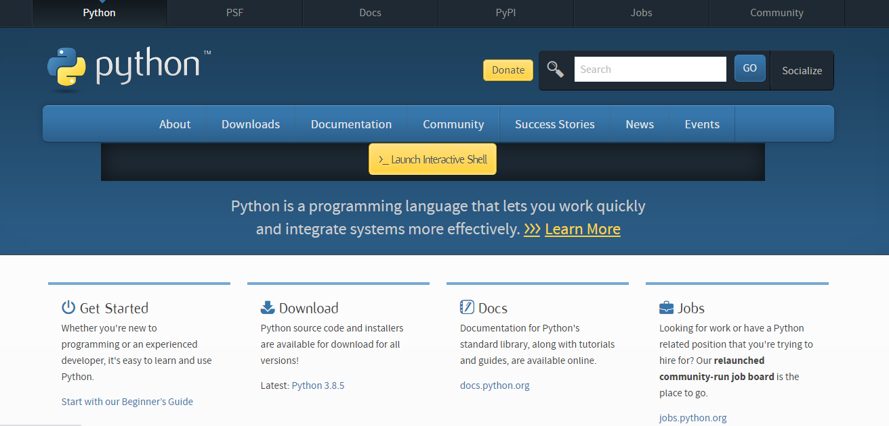
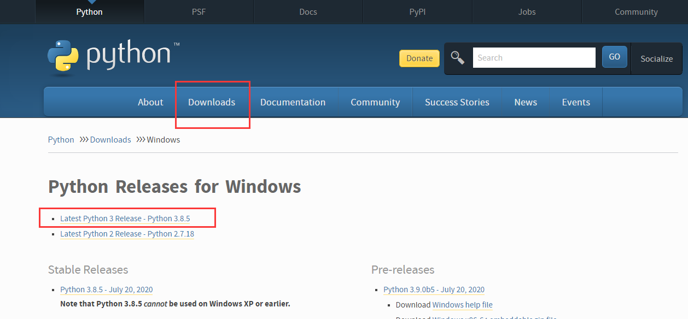
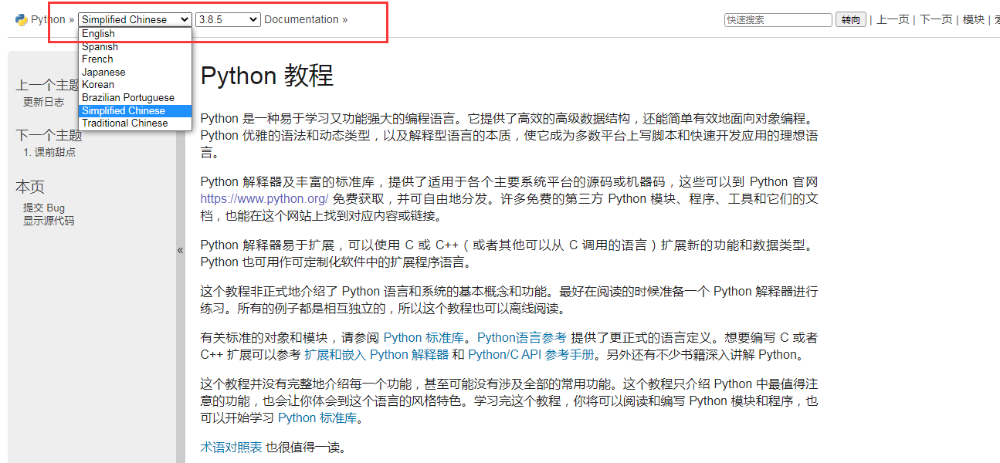
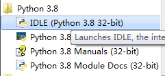
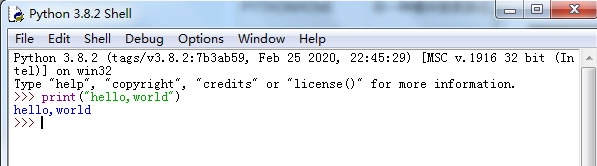
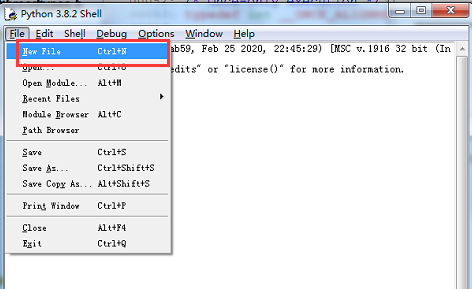
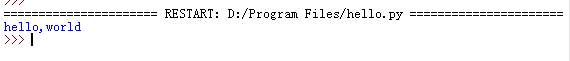

#### 本章要点

- windows下搭建python开发环境
- 编程第一个python程序

### 下载

- 官网地址：https://www.python.org, 如图：




- windows下载地址：https://www.python.org/downloads/windows/, 选择python3.X即可。如图：




- 官方教程地址：https://docs.python.org/zh-cn/3/tutorial/index.html, 红框位置，可选择语言和版本，如图：

  

  更多地参考资料，可访问：https://www.python.org/doc/

### 安装

下载后，双击安装包，进入python安装向导，只需要使用默认设置，点击“下一步”直到安装完成即可。

### 开发环境

为了更聚焦于python本身的学习，建议初学者直接使用官方自带的IDE。在开始菜单中，找到如图程序(IDLE)打开即可。



双击打开之后，进入的是python命令行终端，这是一种交互式运行方式，当输入命令后，会立即回显执行结果，如图：



**但是，**该方式，不能保存代码。因此，我们采用脚本文件的方式，来保存代码。

在"File"菜单下，选择”New File“创建新文件。同样，可以在该菜单下选择"打开"已保存文件等操作。




### hello,world

按照国际惯例，学习一门新语言，第一个程序都是向世界问好。因此，按如下步骤来编写第一个python程序。

1. 新建`.py`文件，参见上一节；

2. 输出"hello,world"，代码如下：

   ```
   print("hello,world")
   ```

   

3. 保存：菜单"File"-->“Save”，或者直接按`ctlr+s`保存文件，并命名为"hello.py"；

4. 运行：菜单"Run"-->"Run Module"，或者直接按`F5`；

5. 如果环境正常的话，可以从终端看到输出：


