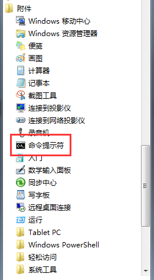
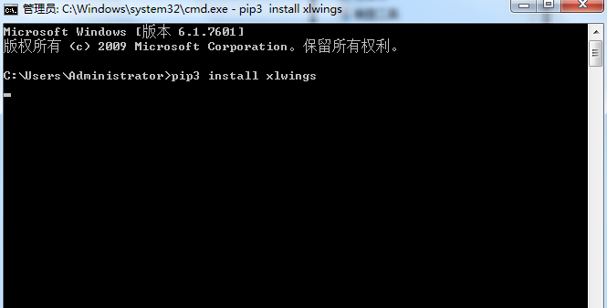

#### 本章要点

- 安装xlwings模块

#### xlwings介绍

xlwings是一款操作excel，快速，功能完善的库。调用灵活，方便，使用简单。

以上这些话，是从网上抄来的，在这以前，我也没用过。

### 环境准备

xlwings属于第三方模块，因此，使用时需要手动安装。

安装步骤如下：

1、windows下，"开始"菜单下，找到“附件”，然后，打开"命令提示符"，如图：



2、在命令行下，输入`pip3 install xlwings`，如图：



3、等待完成即可。

### 环境测试

检查是否正常，可以打开，python的`IDLE`，然后，执行如下命令：

```
import xlwings
```

如果没有报错，则说明安装正常。

这条命令表示，将`xlwings`模块，导入到当前模块中，通过`import`导入后，就可以在本模块中使用了。


第三方模块的安装，基本都能通过类似方法，进行安装。


*祝玩得开心！*

