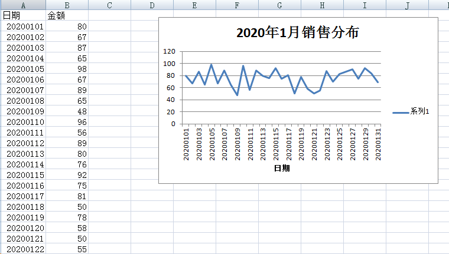

#### 本章要点

- 使用xlwings生成图表

### 功能介绍

使用`xlwings`包，生成一个Excel图表。同时设置好图表的标题，及横轴。

Excel测试数据集如下：

| 日期     | 金额 |
| -------- | ---- |
| 20200101 | 80   |
| 20200102 | 67   |
| 20200103 | 87   |
| 20200104 | 65   |
| 20200105 | 98   |
| 20200106 | 67   |
| 20200107 | 89   |
| 20200108 | 65   |
| 20200109 | 48   |
| 20200110 | 96   |
| 20200111 | 56   |
| 20200112 | 89   |
| 20200113 | 80   |
| 20200114 | 76   |
| 20200115 | 57   |
| 20200116 | 84   |
| 20200117 | 65   |
| 20200118 | 95   |
| 20200119 | 69   |
| 20200120 | 61   |
| 20200121 | 85   |
| 20200122 | 69   |
| 20200123 | 82   |
| 20200124 | 84   |
| 20200125 | 59   |
| 20200126 | 56   |
| 20200127 | 67   |
| 20200128 | 90   |
| 20200129 | 99   |
| 20200130 | 98   |
| 20200131 | 53   |

### 功能实现

#### 准备

手动创建一个Excel文档，并在第一个sheet中，将测试数据录入。

#### 编码

新建一个python文件，编程实现图表生成。编码内容如下：

1、导入`xlwings`包，为了简化输入，使用xw作为别名

```
import xlwings as xw
```

2、设置应用参数，`visible`为`False`表示在后台执行，也就是执行时，看不到Excel的运行界面；`add_book`为`False`，则表示启动应用时不会新建一个工作簿：

```
app = xw.App(visible=False, add_book=False)
```

3、打开一个excel文档，建议在传入的文件名，为绝对路径：

```
wb = xw.Book("E:\github\python\src\data.xlsx")
```

4、指定一个sheet作为操作数据。

```
sht0 = wb.sheets[0]
```

5、设置图表在Excel中显示的位置，注意这里的位置，是距离左上角的偏移。

```
chart = sht0.charts.add(200, 10)
```

6、设置图表数据源，即图表中显示的数据。

```
chart.set_source_data(sht0.range("B2").expand())
```

7、设置图表类型，本次显示为折线，所以赋值为`line`。其他类型会名称是什么呢？

```
chart.chart_type = 'line'
```

8、设置图表标题内容，这里需要通过`SetElemnet`来设置标题的位置。

```
chart.api[1].SetElement(2)
chart.api[1].ChartTitle.Text = "2020年1月销售分布"
```

9、设置X轴的标题和数据源，即把`日期`一列作为横轴的值。

```
chart.api[1].SetElement(302)
chart.api[1].Axes(1).AxisTitle.Text = "日期"

chart.api[1].SeriesCollection(1).XValues = sht0.range("A2:A32").value
print(chart.api[1].SeriesCollection(1).XValues)
```

10、保存修改并退出

```
# 保存修改
wb.save()

# 关闭工作簿
wb.close()

# 关闭Excel
app.quit()
```

完整代码见：`src/excel_chat.py`

#### 运行

保存python文件，并执行后。打开Excel效果如下：



### 思考题

- 如何实现一个饼图？
- 其他图表类型的名称都是什么？
- `SetElement`中参数都有哪些可选值？


*祝玩得开心！*